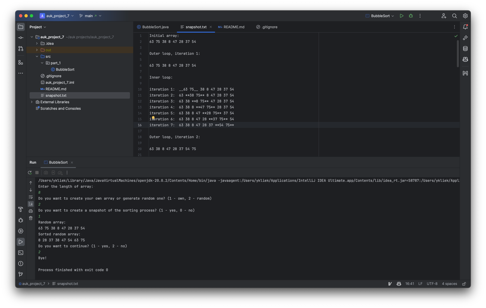

# UK SDT 100: Principles of Programming FA23: Project 7. Array Algorithms

This project provides a console-based implementation of the Bubble Sort algorithm, allowing users to visualize the sorting process with optional snapshots.

## Features

- Collect array input from the user or generate a random array.
- Visualize the sorting process step by step with optional snapshots.
- Display the sorted array.

## File Structure

<pre>
project_5
│
├── public
│   └── static
│       └── [screenshots]
│
├── src
│   └── part_1
│       └── BubbleSort.java
│
├── .gitignore
├── README.md
├── snapshot.txt
└── project_5.iml
</pre>

## Part 1: Bubble Sort Algorithm

This part includes bubble sort algorithm implementation with optional snapshots. Also it has optimised version of bubble sort algorithm which uses a flag that checks whether any swaps have been made during the inner loop's iteration.

